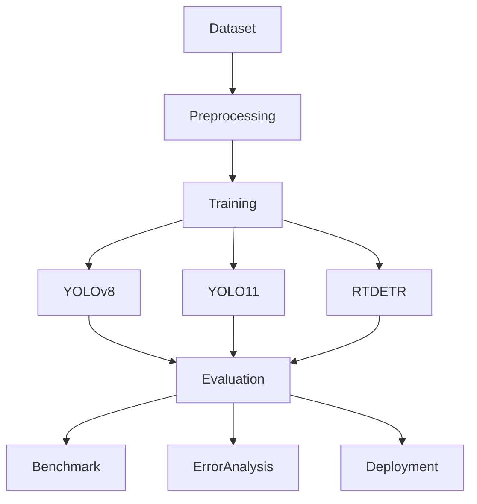
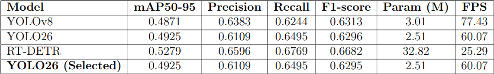

# PPE Detection Comparative Analysis

> Comparative Performance Analysis of CNN-based and Transformer-based Architectures for Real-Time PPE Detection in IoT Systems.


## Overview

This project presents a comprehensive comparative study of modern object detection architectures for Personal Protective Equipment (PPE) detection.

Instead of focusing on a single model, this work evaluates multiple state-of-the-art CNN-based and Transformer-based detectors under identical experimental conditions to analyze their effectiveness for real-time IoT deployment.

The comparison includes:

* YOLOv8
* YOLO26
* RT-DETR

The study evaluates detection accuracy, computational efficiency, inference speed, qualitative performance, and deployment suitability.


## Key Features

* Comparative analysis of multiple object detection architectures
* Benchmarking under identical datasets
* Quantitative evaluation
* Qualitative evaluation
* Failure case analysis
* Computational performance analysis
* COCO dataset validation utilities
* Ready for real-time IoT deployment experiments


## Project Architecture



## Experimental Setup
GPU: RTX 3060 Laptop

Epochs: 50

Image Size: 640

Batch: 8

Optimizer: AdamW

Framework: Ultralytics


## Repository Structure

```text
.
├── docs
├── notebooks
├── results
├── benchmark.py
├── computational.py
├── quantitative.py
├── qualitative_results.py
├── requirements.txt
└── README.md
```


## Models Evaluated

| Model   | Architecture      |
| ------- | ----------------- |
| YOLOv8  | CNN-based         |
| YOLO26  | CNN-based         |
| RT-DETR | Transformer-based |


## Evaluation Criteria

- mAP
- Precision
- Recall
- F1-score
- IoU
- Computational Cost
- Inference Speed
- Model Size
- Qualitative Prediction
- Failure Case Analysis


## Dataset

The dataset is **not included** in this repository because of its large size.

Please download the PPE dataset in roboflow (https://universe.roboflow.com/ppe-ihvqu/ppe-8k2vo/dataset/3#) separately and organize it according to the required directory structure before training.


## Running Experiments

```bash
pip install -r requirements.txt
```

Run training notebooks:

- YOLOv8_PPE_Final_Training_Notebook.ipynb
- YOLO26_PPE_Final_Training_Notebook.ipynb
- RTDETR_PPE_Final_Training_Notebook.ipynb

Workflow:

Dataset

↓

Data Validation

↓

Training

↓

Evaluation

↓

Benchmark

↓

Failure Analysis

↓

Comparison

↓

Conclusion

## Results

The repository includes:

- Benchmark comparison

<p align="center">
  
</p>

- Qualitative Predictions
<p align="center">
  
</p>

- Failure Case Visualization
<p align="center">
  
</p>

- Computational Analysis
<p align="center">
  
</p>

## Future Improvements

- D-FINE comparison
- Grounding DINO
- OWLv2
- Edge deployment benchmarking
- TensorRT optimization
- ONNX inference


## Author

- Pham Tan Minh 
- Doan Duy Long
- Nguyen Tran Hai Phong

Computer Vision • AI Engineering • Backend AI Systems

- Linkedln: Minh Pham Tan 
- Email: phamtanminh2004@gmail.com
